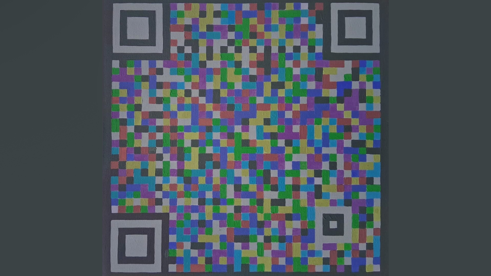
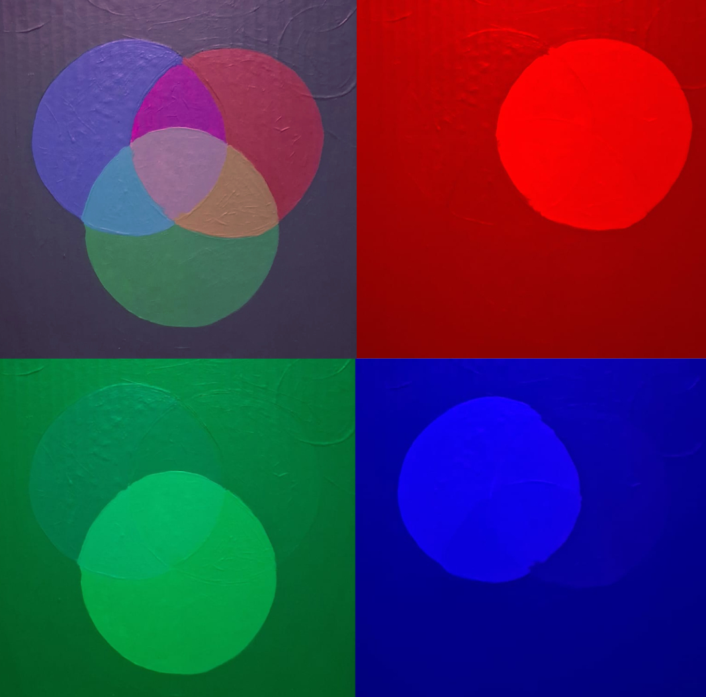
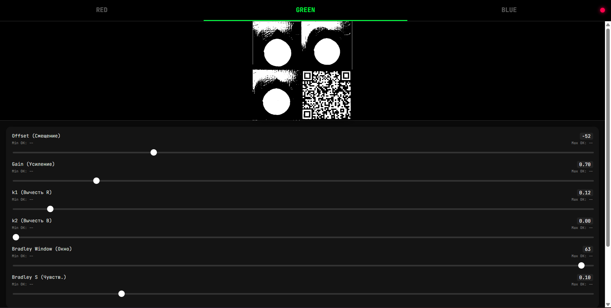
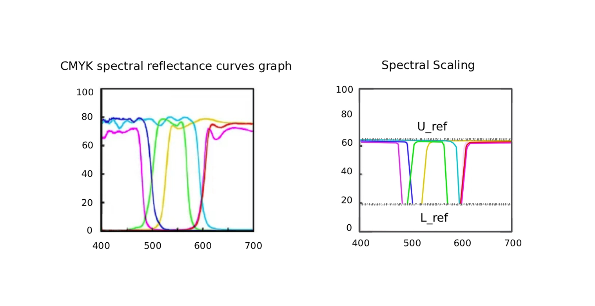

# Universal Spectral Model for Multi-channel Data Encoding

This project introduces a deterministic framework for independent channel encoding in subtractive media, overcoming traditional spectral crosstalk barriers in high-capacity data storage.

## Overview
While RGB channels can theoretically triple data capacity, physical implementation via standard printing (CMYK) suffers from spectral overlap. This model ensures **channel integrity at the printing stage**, transforming any physical surface into a high-capacity, stable data carrier.

*Figure 1: Proof of Concept. SCI-based QR code and color chart on canvas (acrylic).*

## Technical Supplement: Solving the Physical Medium Problem

### 1. The Crosstalk Barrier
Standard color QR codes perform well on emissive screens (RGB). However, physical pigments "contaminate" each other's spectra. Historically, this crosstalk was treated as an unavoidable noise to be fixed by software. 

### 2. The Solution: Deterministic Integrity
We propose ensuring **spectral purity at the printing stage**. By selecting colors based on a deterministic spectral response, we ensure that R, G, and B channels remain isolated even in a subtractive environment. This proves that the physical limitations of the subtractive medium are **surmountable**.

*Figure 2: Stability of color channels under various illuminants (Daylight vs LED).*

### 3. Benefits
* **Multiplied Capacity:** 3x data density compared to monochrome codes.
* **Aesthetic Integration:** QR codes evolve into aesthetically engaging packaging elements.
* **Reliability:** Decoupled channels allow for high-speed, error-free scanning.

*Figure 3: Real-time spectral decoupling in the custom scanner app.*

*Figure 4: Mathematical model for deterministic spectral response.*

## Industrial Implementation Roadmap
To transition from theory to an industrial "print driver," the following is required:
* **Spectrophotometric Calibration:** Professional-grade equipment for precise pigment mapping.
* **Industry Partnerships:** Trials on industrial-scale facilities.
* **Investment:** Scaling the theoretical model into a market-ready solution.

---
**Project Links:**
* [Interactive Scanner (Web Demo)](https://astra31415926.github.io/RGB-11-01-01/)
* [Technical Logic (Source Code)](https://github.com/astra31415926/RGB-11-01-01/blob/main/script.js)
